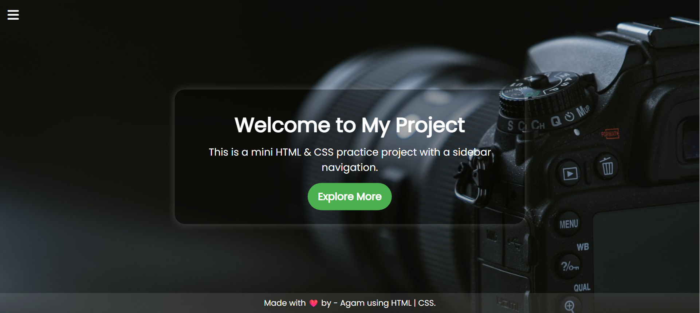
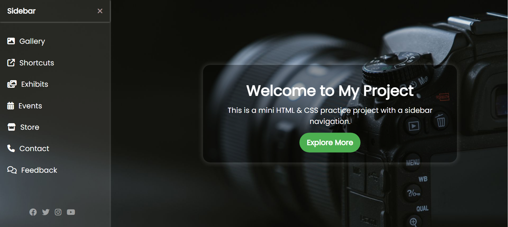
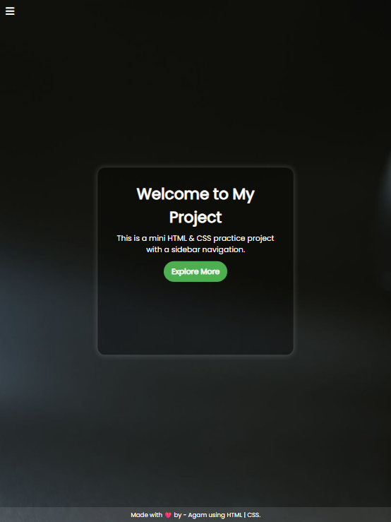
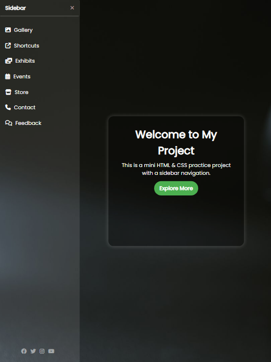
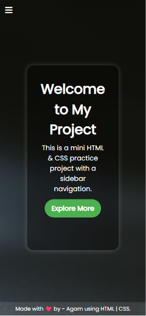
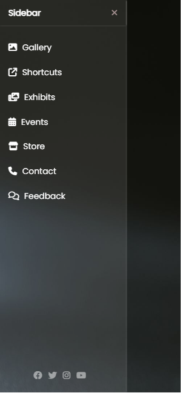

# 🌐 Mini Project - Sidebar Navigation with HTML & CSS

This is a **mini HTML & CSS project** showcasing a stylish sidebar navigation with animations, icons, and a responsive design. It uses **Font Awesome** icons and **Google Fonts** for a modern look.

---

## 📂 Project Structure
```
├── main.html      # Main HTML file
├── style1.css     # CSS styling for the project
├── photo.jpg      # Background image (you can replace with your own)
```

---

## ✨ Features
- ✅ Responsive sidebar navigation  
- ✅ Toggle menu with hamburger (`☰`) and close (`×`) buttons  
- ✅ Integrated **Font Awesome icons** for better visuals  
- ✅ Responsive design (works on different screen sizes)  
- ✅ Hover animations for menu items and social icons  
- ✅ Footer with a personal credit line  

---

## 🚀 How to Run
1. Clone the repository:
   ```bash
   git clone https://github.com/your-username/your-repo-name.git
   ```
2. Open the project folder:
   ```bash
   cd your-repo-name
   ```
3. Open **`main.html`** in your browser.

---

## 🖼️ Preview
### Laptops / Desktops



### Tablets / iPads 



### Mobiles




---

## 📌 Technologies Used
- **HTML5**
- **CSS3**
- [Font Awesome](https://fontawesome.com/)
- [Google Fonts (Poppins)](https://fonts.google.com/specimen/Poppins)

---

## 📬 Author
👨‍💻 Made with ❤️ by **Agam**  
📌 Using **HTML & CSS only**

---

## 📄 License
This project is licensed under the [MIT License](LICENSE).  
Feel free to use and modify it for your own learning and projects.
